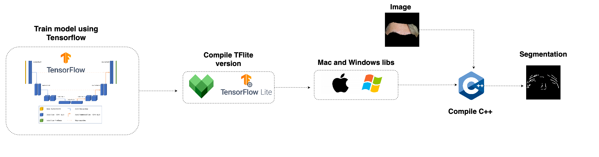

# TFlite for Segmentation
This project demonstrates how to use a segmentation model trained in TensorFlow and convert it to TensorFlow Lite for execution in C++ on both Mac and Windows operating systems. The focus is on image segmentation, using a model previously trained in TensorFlow and performing inference on devices with TensorFlow Lite.
# Diagram
<center>
<div style="display: flex; gap: 10px;">
    
</div>
</center>

# Use on Mac 
  ```
  brew install cmake
  cd mac
  mkdir build && cd build
  cmake ..
  make
  ./TFLiteCheck YOUR_MODEL_path YOUR_IMAGE_path
  ```


# Use on Windows


